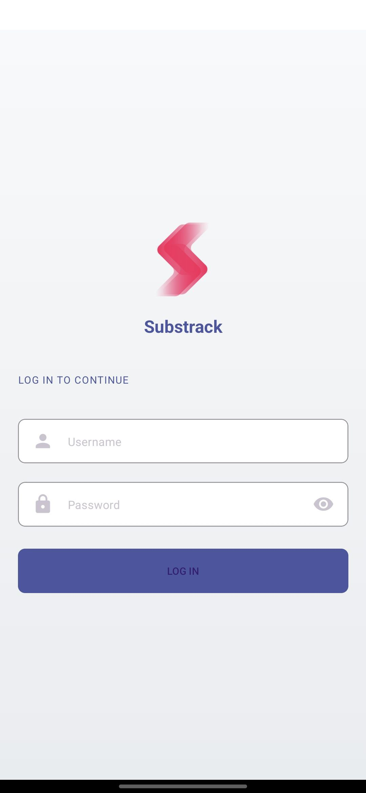
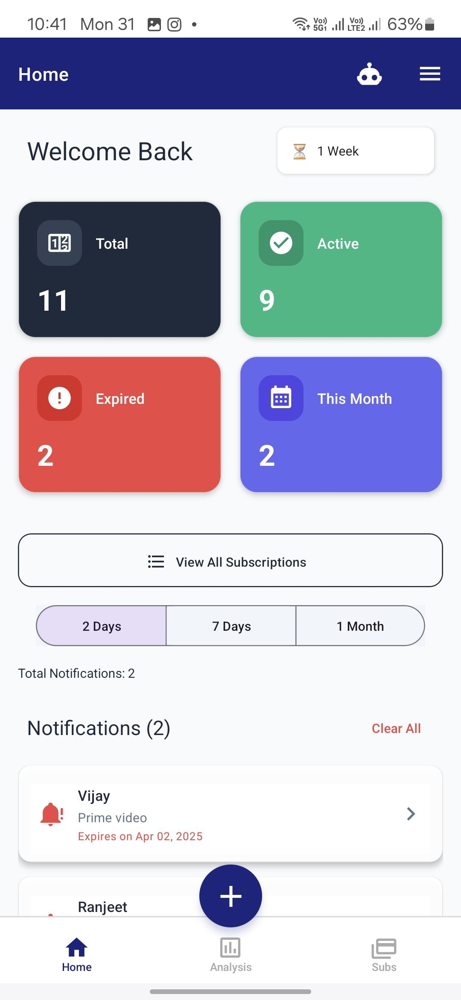
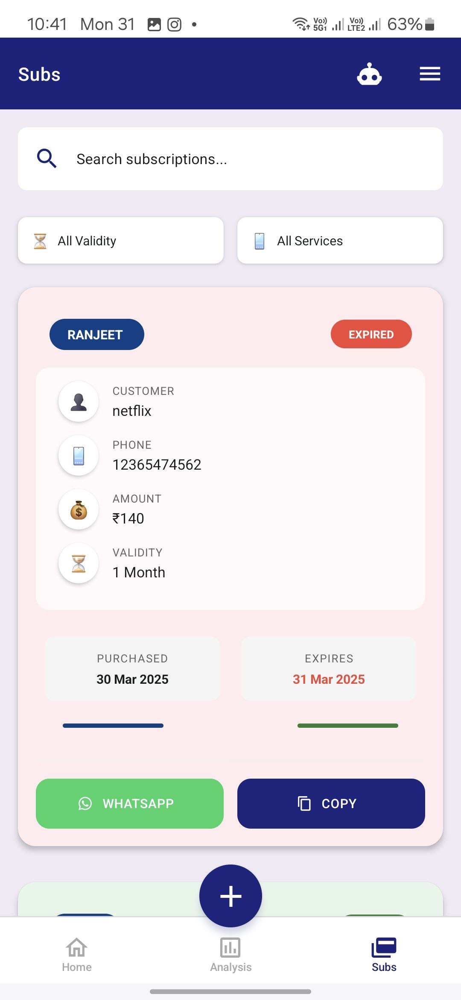
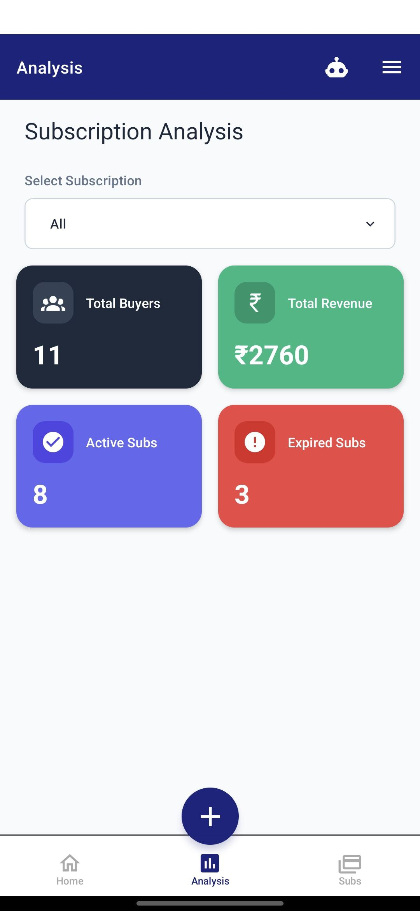

# Substrack - Subscription Management App

A modern React Native application for managing customer subscriptions with analytics, notifications, and AI insights.

## 📱 App Screenshots

<div style="display: flex; flex-wrap: wrap; gap: 10px;">
  
  
  
  
</div>

## 🚀 Features

- 📱 Modern UI with Dark/Light mode
- 🔐 Secure Authentication with Supabase
- 📊 Advanced Analytics Dashboard
- 🔔 Smart Notifications System
- 🤖 AI-powered Insights
- 💬 WhatsApp Integration
- 📱 Cross-platform (iOS & Android)

## 🛠️ Tech Stack

- React Native with Expo
- TypeScript
- Supabase (Backend & Auth)
- React Native Paper (UI Components)
- Expo Router (Navigation)

## ⚙️ Prerequisites

- Node.js (v16 or newer)
- npm or yarn
- Expo CLI (`npm install -g expo-cli`)
- Supabase Account

## 🔧 Installation

1. Clone the repository:
```bash
git clone https://github.com/azhardotcoder/react-native-substrack.git
cd react-native-substrack
```

2. Install dependencies:
```bash
npm install
```

3. Create `.env` file in root directory:
```env
EXPO_PUBLIC_SUPABASE_URL=your_supabase_url
EXPO_PUBLIC_SUPABASE_ANON_KEY=your_supabase_anon_key
EXPO_PUBLIC_TELEGRAM_BOT_TOKEN=your_telegram_bot_token
EXPO_PUBLIC_TELEGRAM_CHAT_ID=your_telegram_chat_id
```

4. Start the development server:
```bash
npm start
```

## 📱 Running on Device

1. Install Expo Go app on your device
2. Scan QR code from terminal
3. Or run on emulator:
```bash
npm run android
# or
npm run ios
```

## 🗄️ Database Setup

1. Create a Supabase project
2. Run these SQL migrations:
```sql
-- Create users table
CREATE TABLE users (
  id UUID PRIMARY KEY DEFAULT uuid_generate_v4(),
  email TEXT UNIQUE NOT NULL,
  created_at TIMESTAMP WITH TIME ZONE DEFAULT TIMEZONE('utc'::text, NOW())
);

-- Create subscriptions table
CREATE TABLE subscriptions (
  id UUID PRIMARY KEY DEFAULT uuid_generate_v4(),
  user_id UUID REFERENCES users(id),
  customer_name TEXT NOT NULL,
  customer_email TEXT,
  phone_number TEXT,
  subscription_name TEXT NOT NULL,
  amount DECIMAL NOT NULL,
  buy_date DATE NOT NULL,
  expiry_date DATE NOT NULL,
  notification_dismissed BOOLEAN DEFAULT false,
  created_at TIMESTAMP WITH TIME ZONE DEFAULT TIMEZONE('utc'::text, NOW())
);
```

## 🔑 API Keys Required

1. **Supabase**
   - Create account at [Supabase](https://supabase.com)
   - Get URL and Anon Key from project settings

2. **Telegram Bot** (Optional)
   - Create bot using [BotFather](https://t.me/botfather)
   - Get bot token and chat ID

## 📱 App Features

### Authentication
- Email/Password login
- Session management
- Secure token storage

### Subscription Management
- Add/Edit/Delete subscriptions
- Track expiry dates
- Set reminders

### Analytics
- Total subscriptions overview
- Active vs Expired stats
- Monthly revenue tracking

### Notifications
- Expiry reminders
- Telegram notifications

## 🤝 Contributing

1. Fork the repository
2. Create feature branch
3. Commit changes
4. Push to branch
5. Open pull request

## 📄 License

Proprietary software. All rights reserved.

## 📞 Support

For support or inquiries:
- 📧 Email: azhardotcoder@gmail.com
- 💬 Telegram: @azhardotcoder

## 🔐 Security

Report security vulnerabilities to azhardotcoder@gmail.com

---
Made with ❤️ by [azhardotcoder](https://github.com/azhardotcoder) 